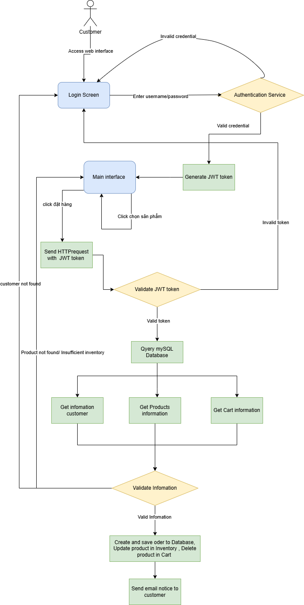
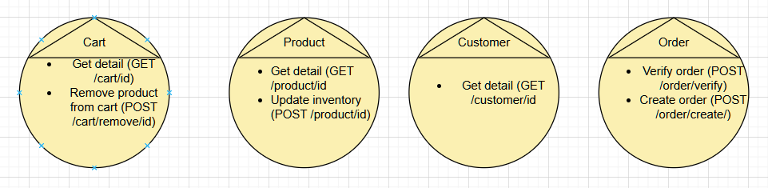
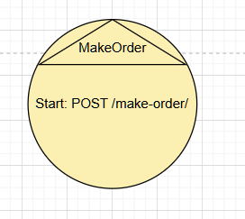
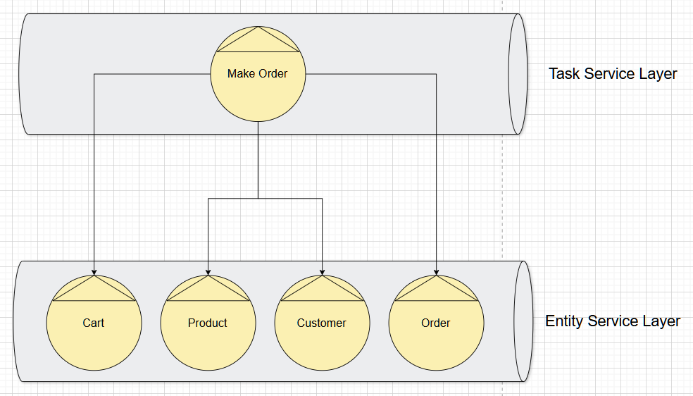
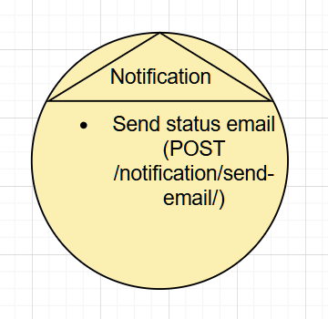
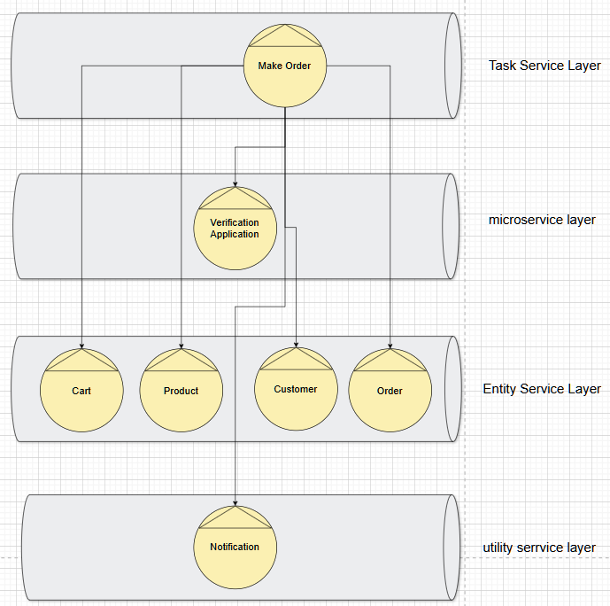

# 📊 Microservices System - Analysis and Design - Đề tài: usecase Đặt Hàng
# 1. Giới thiệu thành viên

# 2. Giới thiệu đề tài
Hệ thống đặt hàng cho phép khách hàng lựa chọn sản phẩm và tiến hành đặt hàng. Hệ thống sẽ nhận thông tin của khách hàng và sản phẩm, kiểm tra yêu cầu đặt hàng và xác minh số lượng sản phẩm trong kho. Nếu số lượng sản phẩm còn đủ, hệ thống sẽ lưu đơn đặt hàng, cập nhật số lượng hàng tồn kho, và gửi email xác nhận đơn hàng cho khách hàng. Nếu không đủ số lượng sản phẩm, quy trình sẽ dừng lại. 

# 3. Công nghệ sử dụng
- **Back-end**: Python (FastAPI).
- **Front-end**: React, Tailwind CSS.
- **Database**: PostgreSQL.
- **API Communication**: RESTful APIs với `fetch` và `async`/`await` trong JavaScript.
- **Authentication**: JWT (JSON Web Tokens).

# 4. Phân tíchtích
REST service modeling

## **Step 1: Decompose Business Process**

Quy trình đặt hằng bao gồm các hoạt động chi tiết sau:
- Khách hàng đăng nhập vào hệ thống
- Khách hàng click chọn những sản phẩm muốn đặt trong giỏ hàng
- Khách hàng click đặt hàng 
- Xác thực người dùng bằng token JWT
- Nhận thông tin của khách hàng, giỏ hàng, số lượng tồn kho
    - Nếu thông tin hợp lệ (Khách hàng hợp lệ, Sản phẩm hợp lệ, Số lượng tồn kho đáp ứng đủ) -> Chuyển sang bước tiếp theo.
    - Nếu thông tin không hợp lệ: 
        - Khách hàng không tồn tại -> Yêu cầu đăng nhập lại
        - Sản phẩn không tồn tại -> Yêu cầu chọn lại sản phẩm
        - Số lượng tồn kho không đủ -> Thông báo kho chỉ còn xx và yêu cầu chọn lại số lượng đặt hàng.
- Tạo và lưu bản ghi order vào database, cập nhập lại số lượng sản phẩm còn trong kho, xóa sản phẩm khỏi giỏ hàng, gửi email thông báo thành công đến khách hàng.

// TODO: flowchart

Quy trình nghiệp vụ của usecase đặt hàng bao gồm các nghiệp vụ sau
- Bắt đầu quy trình đặt hàng
- Khách hàng đăng nhập và nhận token JWT
- Khách hàng bấm đặt hàng
- Xác minh token JWT để đảm bảo phiên đăng nhập hợp lệ
- Nhận thông tin chi tiết về khách hàng
- Nhận thông tin chi tiết về giỏ hàng.
- Xác minh thông tin
- Nếu thông tin không hợp lệ, kết thúc quá trình và hiện thị lỗi.
- Nếu thông tin hợp lệ, thực hiện thao tác thêm order và cập nhập giỏ hàng, inventory
- Gửi thông báo kết quả cho khách hàng

## **Step 2: Filter Out Unsuitable Actions**
Lọc ra các hành động không phù hợp. Một số hoạt động không phù hợp tự động hóa hoặc đóng gói dịch vụ sẽ bị gạch bỏ:
- Bắt đầu quy trình đặt hàng
- Khách hàng đăng nhập và nhận token JWT
- ~~Khách hàng bấm đặt hàng~~
- Xác minh token JWT để đảm bảo phiên đăng nhập hợp lệ
- Nhận thông tin chi tiết về khách hàng
- Nhận thông tin chi tiết về giỏ hàng.
- Xác minh thông tin
- Nếu thông tin không hợp lệ, kết thúc quá trình và hiện thị lỗi.
- Nếu thông tin hợp lệ, thực hiện thao tác 
    - Thêm order
    - Cập nhập giỏ hàng
    - Cập nhập inventory
- Gửi thông báo kết quả cho khách hàng
- ~~Khách hàng thêm sản phẩm vào giỏ hàng~~
- ~~Khách hàng thay đổi số lượng trong giỏ hàng~~
## **Step 3: Define Entity Service Candidates**
Xác định các ứng viên Entity Service. Bằng cách phân tích các hành động còn lại.
Phân loại hành động bất khả tri và ***không theo bất khả tri***
- ***Bắt đầu quy trình đặt hàng***
- ***Khách hàng đăng nhập và nhận token JWT***
- ***Khách hàng bấm đặt hàng***
- ***Xác minh token JWT để đảm bảo phiên đăng nhập hợp lệ***
- Nhận thông tin chi tiết về khách hàng
- Nhận thông tin chi tiết về giỏ hàng.
- Nhận thông tin chi tiết về sản phẩm.
- ***Xác minh thông tin***
- ***Nếu thông tin không hợp lệ, kết thúc quá trình và hiện thị lỗi.***
- ***Nếu thông tin hợp lệ, thực hiện thao tác ***
    - Thêm order
    - Cập nhập giỏ hàng
    - Cập nhập inventory
- ***Gửi thông báo kết quả cho khách hàng***

Các hành động bất khả tri được phân loại thành Entity Service:
- **User Service**: Quản lý đăng nhập và thông tin khách hàng: `(POST /login, GET /customer/{cid}).`
- **Cart Service**: Cung cấp thông tin giỏ hàng, cập nhập giỏ hàng khi đặt hàng thành công có `(GET /cart/{customerId}, PUT /cart/{customerId})`
- **Order service**: Tạo order khi thông tin hợp lệ: `(POST /order)`
- **Product service**: Cung cấp thông tin sản phẩm, cập nhập inventory sản phẩm. `(GET /product/{id}, PUT /product/{id})`

// TODO: Image entity service candicate

## **Step 4: Identify Process-Specific Logic**

Bước này được đề ra để xác định Task service. Các hành động không tuân theo bất khả tri vì chúng được quy định cụ thể cho quy tình đặt hàng:

- Bắt đầu quy trình đặt hàng (1)
- ***Khách hàng đăng nhập và nhận token JWT***
- ***Khách hàng bấm đặt hàng***
- ***Xác minh token JWT để đảm bảo phiên đăng nhập hợp lệ***
- ***Xác minh thông tin***
- ***Nếu thông tin không hợp lệ, kết thúc quá trình và hiện thị lỗi.***
- ***Nếu thông tin hợp lệ, thực hiện thao tác cập nhập***
- ***Gửi thông báo kết quả cho khách hàng***

Hành động đầu tiên (1) trong danh sách này tạo thành một cơ sở cho ứng viên năng lực dịch vụ, được viết gắn ngon thành **MakeOrder-Serivce**.

Các hành động còn lại không tương ứng với các ứng viên năng lực dịch vụ. Thay vào đó chúng được xác định là logic xảy ra nội bộ trong **MakeOrder-Service**.
Hành động xác minh token JWT được tách ra thành **Auth-Service** trong tầng microservice để tập trung hóa logic xác thực.

// TODO: Image Task serivce

## **Step 5: Identify Resources**
- Sau khi xem xét các yêu cầu xử lý của các ứng viên năng lực dịch vụ đã được định nghĩa cho đến nay, các tài nguyên niềm năng sau đây đã được xác định:
    -   Non-agnostic:
        + /Make-Order/
    -   Agnostics:
        + /Auth/
        + /Notification/
        + /Product/
        + /Customer/
        + /Cart/
        + /Order/
- Bởi vì quá trình mô hình hóa dịch vụ đã tạo ra 1 tập hợp các Entity Service, mỗi dịch vụ đại diện cho 1 thực thể, nên quyết định thiết lập 1 số ánh xạ sơ bộ giữa các tài nguyên đã xác định và các thực thể, như bảng dưới đây:

|   Entity |   Resource     |
|   :---:	|   :---:       |
|   Product |   /Product/   |
|   Customer    |   /Customer/      |
| Cart  |   /Cart/  |
| Order  |   /Order/  |

## **Step 6: Associate Service Capabilities with Resources and Methods**

Link service capability candidates 
(Steps 3 and 4) with resources (Step 5) & available uniform contract (HTTP) methods
- **Make-Order-Service** (Task):
    - Method: `STORE /ordering` - Khởi động quy trình đặt hàng
- **Auth-Service** (Microservice):
    - Method:  `GET /validate-token` (xác thực token JWT).
- **User Service**(Entity): 
    - Resource: `/customer/`
    - Methods: `POST /login` (đăng nhập), `GET /customer/{customer_id}` (lấy thông tin khách hàng ).
- **Cart Service**(Entity): 
    - Resource: `\cart`
    - Method:  `(GET /cart/{customerId}` (Lấy thông tin giỏ hàng), `PUT /cart/{customerId})` (Cập nhập giỏ hàng)
- **Order service**(Entity): 
    - Resouces: `/order`
    - Method: `(POST /order)` (Lưu đơn hàng)
- **Product service**(Entity): 
    - Resource: `\product`
    - Method: `(GET /product/{id}` - Lấy thông tin sản phẩm,  `PUT /product/{id})` - Cập nhập số lượng tồn kho.
- **Notification-Service (Utility)**: 
    - Method: `POST /notification` (gửi thông báo).

## **Step 7: Apply Service-Orientation**
- Tài liệu quy trình kinh doanh sử dụng làm đầu vào cho quá trình mô hình hóa dịch vụ có thể cung cấp mức độ kiến thức về quá trình xử lý được yêu cầu bởi từng ứng viên năng lực dịch vụ REST đã được xác định.

- Hình thành thêm định nghĩa và phạm vi của khả năng dịch vụ, cũng như các ứng viên dịch vụ lớn, bằng cách xem xét tập hợp phù hợp của các nguyên tắc định hướng dịch vụ. Mỗi dịch vụ được thiết kế để xử lý một phần cụ thể của quy trình, với giao tiếp thông quá RESTful APIs.

## **Step 8: Identify Service Composition Candidates**

## **Step 9: Analyze Processing Requirements**
- Hành động xác minh thông tin người dùng và sản phẩm, kiểm tra tồn kho và token JWT được thực hiện trong **Make-Order Serivce** thông qua gọi **User Service**, **Cart Service** và **Produc Service**.

## **Step 10: Define Utility Service Candidates (and Associate Resources and Methods)**
- Ứng viên dịch vụ Notification: Hành động Send Email là một ứng viên năng lực dịch vụ, như một phần của dịch vụ tiện ích có tên là Notification. Hành động Send Email sẽ chấp nhận phạm vi giá trị đầu vào, cho phép nó gửi email.
- Ứng viên dịch vụ Notification: Hành động send được mở rộng phương thức `POST /Notification/` và tài nguyên /Notification/

## **Step 11: Define Microservice Candidates (and Associate Resources and Methods)**
- Auth-Service: Hành động validate với phương thức `GET /validate-token`.

## **Step 12 + 13 + 14: Apply Service-Orientation and Revise**
- Step 12: Apply Service-Orientation 
- Step 13: Revise Candidate Service Compositions
- Step 14: Revise Resource Definitions and Capability Candidate grouping

