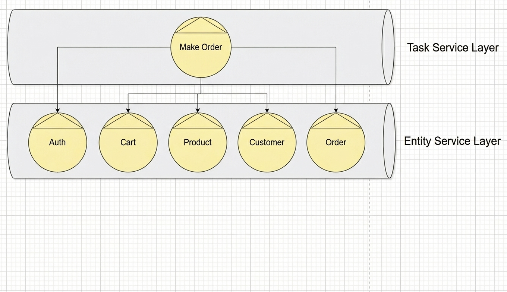
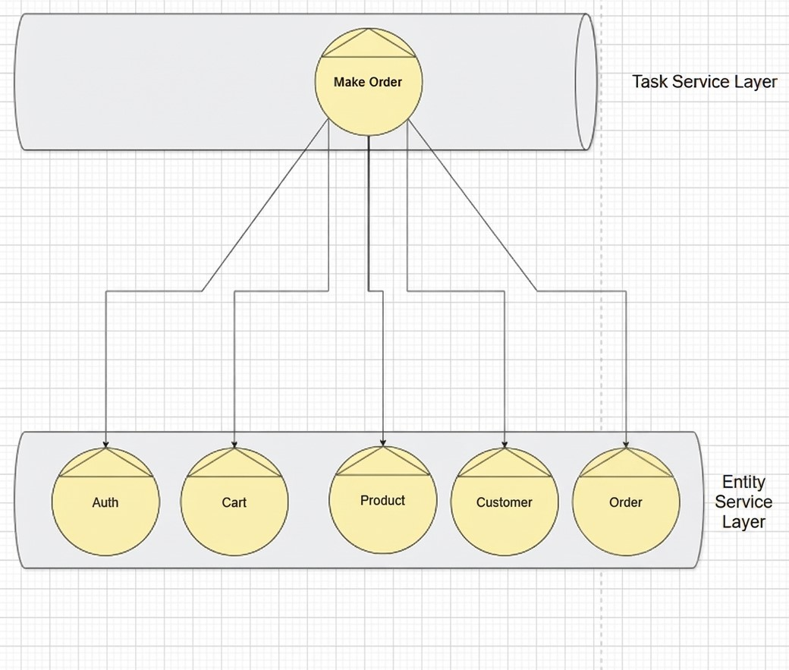

# 📊 Microservices System - Analysis and Design - Đề tài: usecase Đặt Hàng

# 1. Giới thiệu thành viên
Lê Minh Vương - B21DCCN802

# 2. Giới thiệu đề tài
Hệ thống đặt hàng cho phép khách hàng lựa chọn sản phẩm và tiến hành đặt hàng. Hệ thống sẽ nhận thông tin của khách hàng và sản phẩm, kiểm tra yêu cầu đặt hàng và xác minh số lượng sản phẩm trong kho. Nếu số lượng sản phẩm còn đủ, hệ thống sẽ lưu đơn đặt hàng và cập nhật số lượng hàng tồn kho. Nếu không đủ số lượng sản phẩm, quy trình sẽ dừng lại.

# 3. Công nghệ sử dụng
- **Back-end**: Python (FastAPI)
- **Front-end**: React, Tailwind CSS
- **Database**: PostgreSQL (Database per Service)
- **API Communication**: RESTful APIs với `fetch` và `async`/`await` trong JavaScript
- **Authentication**: JWT (JSON Web Tokens)
- **Container**: Docker & Docker Compose

# 4. Phân tích
REST service modeling

## **Bước 1: Phân tích Quy trình Nghiệp vụ**

Quy trình đặt hàng bao gồm các hoạt động chi tiết sau:
- Khách hàng đăng nhập vào hệ thống
- Khách hàng click chọn những sản phẩm muốn đặt trong giỏ hàng
- Khách hàng click đặt hàng
- Xác thực người dùng bằng token JWT
- Nhận thông tin của khách hàng, giỏ hàng, số lượng tồn kho
    - Nếu thông tin hợp lệ (Khách hàng hợp lệ, Sản phẩm hợp lệ, Số lượng tồn kho đáp ứng đủ) -> Chuyển sang bước tiếp theo
    - Nếu thông tin không hợp lệ:
        - Khách hàng không tồn tại -> Yêu cầu đăng nhập lại
        - Sản phẩm không tồn tại -> Yêu cầu chọn lại sản phẩm
        - Số lượng tồn kho không đủ -> Thông báo kho chỉ còn xx và yêu cầu chọn lại số lượng đặt hàng
- Tạo và lưu bản ghi order vào database, cập nhật lại số lượng sản phẩm còn trong kho, xóa sản phẩm khỏi giỏ hàng

Quy trình nghiệp vụ của usecase đặt hàng bao gồm các nghiệp vụ sau:
- Bắt đầu quy trình đặt hàng
- Khách hàng đăng nhập và nhận token JWT
- Khách hàng bấm đặt hàng
- Xác minh token JWT để đảm bảo phiên đăng nhập hợp lệ
- Nhận thông tin chi tiết về khách hàng
- Nhận thông tin chi tiết về giỏ hàng
- Xác minh thông tin
- Nếu thông tin không hợp lệ, kết thúc quá trình và hiển thị lỗi
- Nếu thông tin hợp lệ, thực hiện thao tác thêm order và cập nhật giỏ hàng, inventory

## **Bước 2: Lọc các Hành động Không phù hợp**
Lọc ra các hành động không phù hợp. Một số hoạt động không phù hợp tự động hóa hoặc đóng gói dịch vụ sẽ bị gạch bỏ:
- Bắt đầu quy trình đặt hàng
- Khách hàng đăng nhập và nhận token JWT
- ~~Khách hàng bấm đặt hàng~~
- Xác minh token JWT để đảm bảo phiên đăng nhập hợp lệ
- Nhận thông tin chi tiết về khách hàng
- Nhận thông tin chi tiết về giỏ hàng
- Xác minh thông tin
- Nếu thông tin không hợp lệ, kết thúc quá trình và hiển thị lỗi
- Nếu thông tin hợp lệ, thực hiện thao tác:
    - Thêm order
    - Cập nhật giỏ hàng
    - Cập nhật inventory
- ~~Khách hàng thêm sản phẩm vào giỏ hàng~~
- ~~Khách hàng thay đổi số lượng trong giỏ hàng~~

## **Bước 3: Xác định Entity Service Candidates**
Xác định các ứng viên Entity Service. Bằng cách phân tích các hành động còn lại.
Phân loại hành động bất khả tri và ***không theo bất khả tri***:
- ***Bắt đầu quy trình đặt hàng***
- ***Khách hàng đăng nhập và nhận token JWT***
- ***Xác minh token JWT để đảm bảo phiên đăng nhập hợp lệ***
- Nhận thông tin chi tiết về khách hàng
- Nhận thông tin chi tiết về giỏ hàng
- Nhận thông tin chi tiết về sản phẩm
- ***Xác minh thông tin***
- ***Nếu thông tin không hợp lệ, kết thúc quá trình và hiển thị lỗi***
- ***Nếu thông tin hợp lệ, thực hiện thao tác:***
    - Thêm order
    - Cập nhật giỏ hàng
    - Cập nhật inventory

Các hành động bất khả tri được phân loại thành Entity Service:
- **Customer Service**: Quản lý thông tin khách hàng: `GET /customers/{id}`
- **Cart Service**: Cung cấp thông tin giỏ hàng, cập nhật giỏ hàng khi đặt hàng thành công: `GET /customers/{customer_id}/cart`, `DELETE /customers/{customer_id}/cart`
- **Order Service**: Tạo đơn hàng khi thông tin hợp lệ: `POST /orders`
- **Product Service**: Cung cấp thông tin sản phẩm, cập nhật tồn kho sản phẩm: `GET /products/{id}`, `GET /products/{id}/stock`, `PUT /products/{id}/stock`

## **Bước 4: Xác định Logic đặc thù cho Quy trình**

Bước này được đề ra để xác định Task service. Các hành động không tuân theo bất khả tri vì chúng được quy định cụ thể cho quy trình đặt hàng:

- Bắt đầu quy trình đặt hàng (1)
- ***Khách hàng đăng nhập và nhận token JWT***
- ***Xác minh token JWT để đảm bảo phiên đăng nhập hợp lệ***
- ***Xác minh thông tin***
- ***Nếu thông tin không hợp lệ, kết thúc quá trình và hiển thị lỗi***
- ***Nếu thông tin hợp lệ, thực hiện thao tác cập nhật***

Hành động đầu tiên (1) trong danh sách này tạo thành một cơ sở cho ứng viên năng lực dịch vụ, được viết gọn thành **Make-Order-Service**.

Các hành động còn lại không tương ứng với các ứng viên năng lực dịch vụ. Thay vào đó chúng được xác định là logic xảy ra nội bộ trong **Make-Order-Service**.
Hành động xác minh token JWT được tách ra thành **Auth-Service** trong tầng microservice để tập trung hóa logic xác thực.

## **Bước 5: Xác định Resources**
- Sau khi xem xét các yêu cầu xử lý của các ứng viên năng lực dịch vụ đã được định nghĩa cho đến nay, các tài nguyên tiềm năng sau đây đã được xác định:
    - Non-agnostic:
        + /ordering/
    - Agnostics:
        + /auth/
        + /products/
        + /customers/
        + /cart/
        + /orders/
- Bởi vì quá trình mô hình hóa dịch vụ đã tạo ra 1 tập hợp các Entity Service, mỗi dịch vụ đại diện cho 1 thực thể, nên quyết định thiết lập 1 số ánh xạ sơ bộ giữa các tài nguyên đã xác định và các thực thể, như bảng dưới đây:

| Entity | Resource |
| :---: | :---: |
| Product | /products/ |
| Customer | /customers/ |
| Cart | /cart/ |
| Order | /orders/ |

## **Bước 6: Liên kết Service Capabilities với Resources và Methods**

Liên kết các ứng viên năng lực dịch vụ (Bước 3 và 4) với resources (Bước 5) và các phương thức HTTP:
- **Make-Order-Service** (Task):
    - Method: `POST /ordering` - Khởi động quy trình đặt hàng
- **Auth-Service** (Microservice):
    - Methods: `POST /auth/login` (đăng nhập), `GET /auth/validate` (xác thực token JWT)
- **Customer Service** (Entity):
    - Resource: `/customers/`
    - Method: `GET /customers/{id}` (lấy thông tin khách hàng)
- **Cart Service** (Entity):
    - Resource: `/customers/{customer_id}/cart/`
    - Methods: `GET /customers/{customer_id}/cart` (Lấy thông tin giỏ hàng), `POST /customers/{customer_id}/cart` (Thêm sản phẩm), `PUT /customers/{customer_id}/cart/{product_id}` (Cập nhật số lượng), `DELETE /customers/{customer_id}/cart/{product_id}` (Xóa sản phẩm), `DELETE /customers/{customer_id}/cart` (Xóa toàn bộ giỏ hàng)
- **Order Service** (Entity):
    - Resource: `/orders/`
    - Methods: `POST /orders` (Tạo đơn hàng), `GET /orders` (Danh sách đơn hàng), `GET /orders/{id}` (Chi tiết đơn hàng), `PUT /orders/{id}/status` (Cập nhật trạng thái)
- **Product Service** (Entity):
    - Resource: `/products/`
    - Methods: `GET /products` (Danh sách sản phẩm), `GET /products/{id}` (Lấy thông tin sản phẩm), `GET /products/{id}/stock` (Kiểm tra tồn kho), `PUT /products/{id}/stock` (Cập nhật số lượng tồn kho)

## **Bước 7: Áp dụng Service-Orientation**
- Tài liệu quy trình kinh doanh sử dụng làm đầu vào cho quá trình mô hình hóa dịch vụ có thể cung cấp mức độ kiến thức về quá trình xử lý được yêu cầu bởi từng ứng viên năng lực dịch vụ REST đã được xác định.

- Hình thành thêm định nghĩa và phạm vi của khả năng dịch vụ, cũng như các ứng viên dịch vụ lớn, bằng cách xem xét tập hợp phù hợp của các nguyên tắc định hướng dịch vụ. Mỗi dịch vụ được thiết kế để xử lý một phần cụ thể của quy trình, với giao tiếp thông qua RESTful APIs.

## **Bước 8: Xác định Service Composition Candidates**

## **Bước 9: Phân tích Yêu cầu Xử lý**
- Hành động xác minh thông tin người dùng và sản phẩm, kiểm tra tồn kho và token JWT được thực hiện trong **Make-Order-Service** thông qua gọi **Auth-Service**, **Customer-Service**, **Cart-Service** và **Product-Service**.

## **Bước 10: Xác định Utility Service Candidates**
- Không có utility service trong hệ thống này. Hệ thống chỉ bao gồm Task Service (Make-Order), Microservice (Auth), và Entity Services (Customer, Product, Cart, Order).

## **Bước 11: Xác định Microservice Candidates**
- **Auth-Service**: Hành động xác thực với phương thức `GET /auth/validate` và đăng nhập với `POST /auth/login`.

## **Bước 12 + 13 + 14: Áp dụng Service-Orientation và Xem xét lại**
- Bước 12: Áp dụng Service-Orientation
- Bước 13: Xem xét lại Service Compositions
- Bước 14: Xem xét lại định nghĩa Resource và nhóm Capability

# 5. Kết luận
Hệ thống đặt hàng được thiết kế theo kiến trúc microservices với 6 dịch vụ chính:
- **Make-Order-Service** (Task Service): Điều phối toàn bộ quy trình đặt hàng
- **Auth-Service** (Microservice): Xác thực JWT token
- **Customer-Service** (Entity Service): Quản lý thông tin khách hàng
- **Product-Service** (Entity Service): Quản lý sản phẩm và tồn kho
- **Cart-Service** (Entity Service): Quản lý giỏ hàng
- **Order-Service** (Entity Service): Quản lý đơn hàng

Hệ thống sử dụng mô hình Database per Service với PostgreSQL, giao tiếp qua RESTful APIs, và xác thực bằng JWT tokens.
