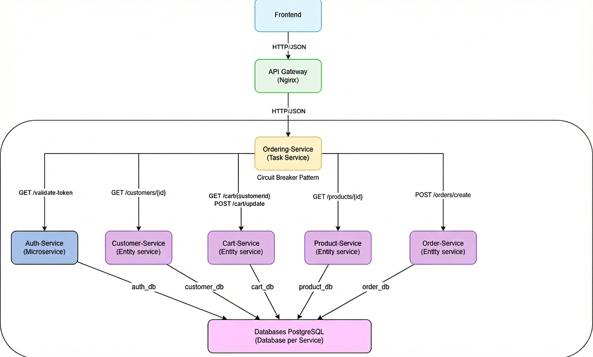
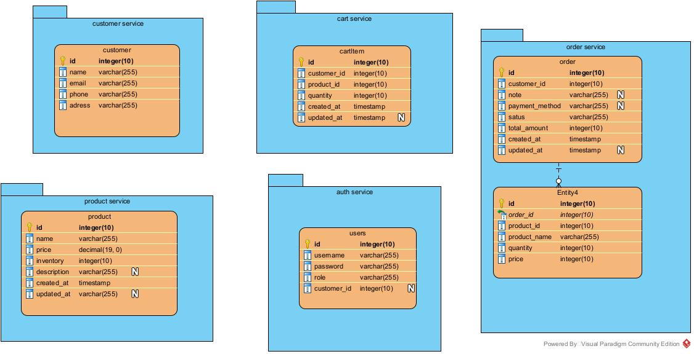

# System Architecture

## Overview
- Hệ thống Đặt Hàng là một hệ thống microservices được thiết kế nhằm hỗ trợ khách hàng lựa chọn sản phẩm và thực hiện quá trình đặt hàng thông qua giao diện web. Hệ thống tiếp nhận thông tin khách hàng và sản phẩm, kiểm tra yêu cầu đặt hàng, và xác minh số lượng tồn kho trước khi xử lý đơn hàng. Nếu số lượng tồn kho đáp ứng đủ, hệ thống sẽ lưu trữ đơn hàng và cập nhật tồn kho. Trong trường hợp số lượng không đủ, quá trình đặt hàng sẽ bị dừng lại. Mục tiêu chính của hệ thống là đảm bảo tính tách biệt, tái sử dụng, và khả năng mở rộng linh hoạt giữa các dịch vụ, đồng thời mang lại trải nghiệm người dùng hiệu quả và an toàn. Hệ thống được triển khai dựa trên kiến trúc hướng dịch vụ (SOA) và sử dụng Docker để thuận tiện trong việc triển khai, quản lý và mở rộng.
- Các thành phần chính bao gồm các microservices xử lý từng chức năng cụ thể, giao tiếp qua API Gateway, và lưu trữ dữ liệu trong cơ sở dữ liệu PostgreSQL (Database per Service pattern). Hệ thống cũng tích hợp xác thực JWT để bảo mật.

## System Components

- **Make-Order-Service (Task Service)**:  
  Dịch vụ này khởi động quy trình đặt hàng thông qua endpoint `POST /ordering`. Nó gọi các dịch vụ khác (Auth-Service, Customer-Service, Product-Service, Order-Service, Cart-Service) để xác thực và xử lý yêu cầu, sau đó trả về kết quả cho frontend. Service này implement Circuit Breaker pattern để bảo vệ hệ thống khỏi cascading failures.
- **Auth-Service (Microservice)**:  
  Dịch vụ này tập trung hóa logic xác thực token JWT. Cung cấp endpoint `POST /auth/login` để đăng nhập và `GET /auth/validate` để xác thực token.
- **Customer-Service (Entity Service)**:  
  Quản lý thông tin khách hàng. Cung cấp endpoint `GET /customers/{id}` để lấy thông tin chi tiết về khách hàng.
- **Product-Service (Entity Service)**:  
  Quản lý thông tin sản phẩm, kiểm tra tồn kho sản phẩm, cập nhật tồn kho khi đặt hàng thành công. Cung cấp các endpoint: `GET /products`, `GET /products/{id}`, `GET /products/{id}/stock`, `PUT /products/{id}/stock`.
- **Cart-Service (Entity Service)**:  
  Quản lý giỏ hàng của khách hàng. Cung cấp các endpoint: `GET /customers/{customer_id}/cart`, `POST /customers/{customer_id}/cart`, `PUT /customers/{customer_id}/cart/{product_id}`, `DELETE /customers/{customer_id}/cart/{product_id}`.
- **Order-Service (Entity Service)**:
  Tạo và quản lý đơn hàng. Cung cấp các endpoint: `GET /orders`, `POST /orders`, `GET /orders/{id}`, `PUT /orders/{id}/status`.
- **API Gateway (Nginx)**:  
  Đóng vai trò là điểm truy cập duy nhất cho frontend, định tuyến các yêu cầu đến các dịch vụ phù hợp dựa trên đường dẫn URL (ví dụ: `/ordering` → Make-Order-Service, `/auth` → Auth-Service).
- **Frontend (React)**:  
  Giao diện web được xây dựng bằng React và Tailwind CSS, tương tác với API Gateway để hiển thị danh sách sản phẩm, thực hiện đặt hàng, và hiển thị thông báo.
- **Database (PostgreSQL)**:  
  Hệ thống sử dụng Database per Service pattern với 5 database riêng biệt: `auth_db` (users), `customer_db` (customers), `product_db` (products), `cart_db` (cart_items), `order_db` (orders, order_items).

## Communication
- **Giao tiếp giữa các dịch vụ**: 
  Tất cả các dịch vụ giao tiếp với nhau thông qua **RESTful APIs**, sử dụng HTTP với định dạng JSON. Các yêu cầu được gửi qua API Gateway, đảm bảo tính nhất quán và bảo mật. Ví dụ:
  - Make-Order-Service gọi Auth-Service (`GET /auth/validate`) để xác thực token.
  - Make-Order-Service gọi Customer-Service (`GET /customers/{id}`) để lấy thông tin khách hàng.
  - Make-Order-Service gọi Product-Service (`GET /products/{id}`) để lấy thông tin sản phẩm.
- **Mạng nội bộ**:  
    Hệ thống sử dụng Docker Compose để triển khai các dịch vụ. Các dịch vụ giao tiếp với nhau bằng tên dịch vụ trong mạng Docker (ví dụ: `http://auth-service:8000`, `http://postgres:5432`). API Gateway (Nginx) định tuyến các yêu cầu từ frontend đến các dịch vụ dựa trên cấu hình trong `nginx.conf`.    
- **Xác thực**:  
    JWT (JSON Web Tokens) được sử dụng để xác thực. Frontend gửi token trong header `Authorization: Bearer <token>` cho mỗi yêu cầu. Make-Order-Service gọi Auth-Service để xác thực token trước khi xử lý yêu cầu.
    
## Data Flow
 - **Luồng đăng nhập**:
  1. Frontend gửi `POST /auth/login` đến API Gateway với thông tin đăng nhập (username/password).
  2. API Gateway định tuyến đến Auth-Service.
  3. Auth-Service kiểm tra thông tin trong PostgreSQL (auth_db), tạo JWT token, và trả về cho frontend.
  4. Frontend lưu token để sử dụng cho các yêu cầu sau.

- **Luồng đặt hàng**:
  1. Frontend gửi `POST /ordering` đến API Gateway với JWT token và thông tin đơn hàng.
  2. API Gateway định tuyến đến Make-Order-Service.
  3. Make-Order-Service gọi Auth-Service (`GET /auth/validate`) để xác thực token.
  4. Auth-Service trả về `customer_id` nếu token hợp lệ.
  5. Make-Order-Service gọi Customer-Service (`GET /customers/{id}`) để xác minh khách hàng.
  6. Make-Order-Service gọi Cart-Service (`GET /customers/{customer_id}/cart`) để lấy thông tin giỏ hàng.
  7. Make-Order-Service gọi Product-Service (`GET /products/{id}/stock`) để kiểm tra tồn kho.
  8. Nếu tồn kho đủ, Make-Order-Service gọi Product-Service (`PUT /products/{id}/stock`) để cập nhật tồn kho.
  9. Make-Order-Service gọi Order-Service (`POST /orders`) để tạo đơn hàng.
  10. Make-Order-Service gọi Cart-Service (`DELETE /customers/{customer_id}/cart`) để xóa giỏ hàng.
  11. Kết quả được trả về cho frontend qua API Gateway.

- **Phụ thuộc bên ngoài**:  
  - **PostgreSQL**: Lưu trữ dữ liệu của Auth-Service, Customer-Service, Product-Service, Cart-Service, và Order-Service (Database per Service).
  - Không có phụ thuộc API bên thứ ba.

## Sơ đồ
Sơ đồ kiến trúc hệ thống:

Sơ đồ cơ sở dữ liệu hệ thống:

## Khả năng Mở rộng & Chịu lỗi
- **Khả năng mở rộng**:
  - Mỗi dịch vụ được triển khai trong container Docker riêng, cho phép mở rộng độc lập. Ví dụ, nếu Make-Order-Service chịu tải cao, có thể tăng số lượng instance bằng cách điều chỉnh Docker Compose hoặc sử dụng một orchestrator như Kubernetes.
  - API Gateway (Nginx) hỗ trợ cân bằng tải, phân phối yêu cầu đến các instance của dịch vụ.
  - PostgreSQL có thể được mở rộng bằng cách sử dụng các kỹ thuật như replication (read replicas) để tăng hiệu suất đọc.

- **Khả năng chịu lỗi**:
  - Hệ thống microservices đảm bảo rằng sự cố ở một dịch vụ không ảnh hưởng đến các dịch vụ khác.
  - **Circuit Breaker Pattern**: Make-Order-Service implement circuit breaker để bảo vệ khỏi cascading failures. Khi tỷ lệ lỗi vượt ngưỡng (mặc định 50%), circuit sẽ mở và chặn requests trong thời gian cooldown (mặc định 30 giây).
  - Docker Compose tự động khởi động lại các container nếu chúng gặp sự cố.
  - API Gateway có thể được cấu hình để thử lại (retry) hoặc chuyển hướng yêu cầu nếu một dịch vụ không phản hồi.
  - Dữ liệu trong PostgreSQL được bảo vệ thông qua các cơ chế sao lưu và khôi phục.